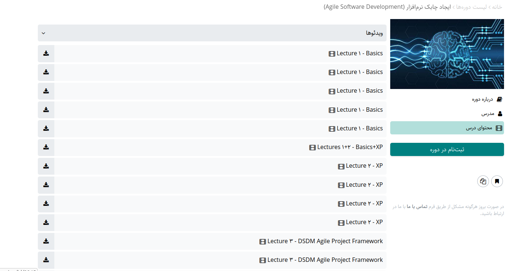
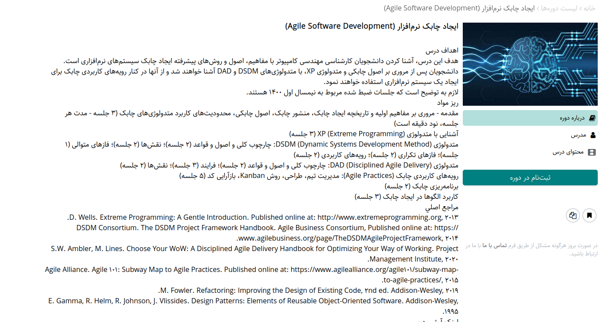
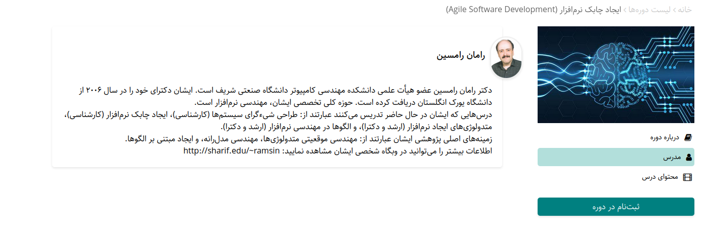
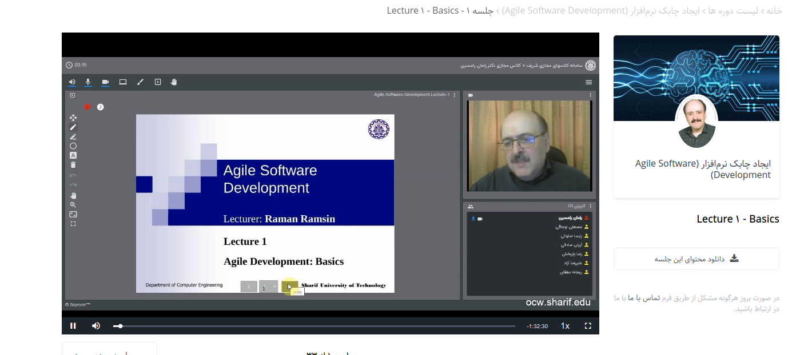

# course title: Agile Software Development
## Description:
This course is based on the most popular methodologies for managing agile teams. most focused on important practices and antipatterns. 
The main references are taken from the most active people in the industry and their experience in software development, such as Martin Fowler or Scott Ambler.
Overall, this course is appropriate for industry and academic research. because of the lecturer, he is one the most famous persons who actively works on software development methodologies and agile principles. 
this course will lead you to use agile appropriately. not the thing called agile in most of companies.

## keynotes:
1. an overview of XP
2. DSDM
3. DAD
4. Agile principles
5. Agile planning
6. patterns in Agile

## resources:
- [Dr. Raman ramsin](https://ocw.sharif.ir/course/id/448/)

## images
### Course overview on the website

### description on the website

### lecturer overview

### example of the first session of the class

